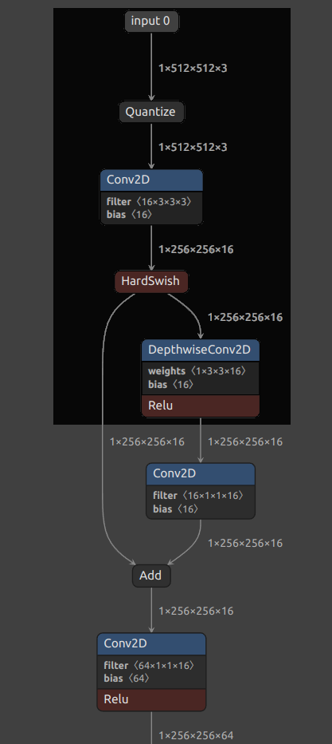

## Tools
A detailed introduction for tools.
### GraphCutter
Cut/Crop a piece of graph from the given TfLite model. Source codes can be found in `graph_cutter` directory.<br/>
<br/>
For example, if you want to cut the region with dark color of graph, please provide the inputs' name and outputs' name of sub-graph.
Like the following command shows:
```bash
tools/graph_cutter --input_tflite ./mobilenet_v3.tflite --output_tflite ./xxx.tflite --from "input" --to "MobilenetV3/depthwise/Relu;Output"
```
If there are multiple inputs or outputs, please use `comma` to separate them. Like the following command shows:
```bash
tools/graph_cutter --input_tflite ./xxx.tflite --output_tflite ./xxx_cut.tflite --from "input_1,input_2" --to "output_1,output_2"
```
If you don't know the input/output tensor's name, visualize model with netron, and check the tensor's name.
